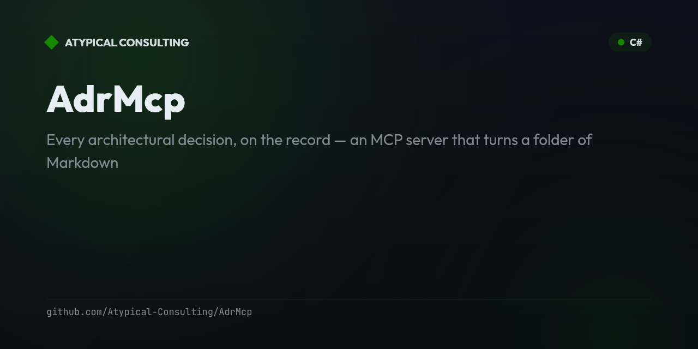

# AdrMcp

<!-- mcp-name: io.github.Atypical-Consulting/adr-mcp -->

**Every architectural decision, on the record** — an MCP server that turns a folder of Markdown
ADRs into live tools your AI agent can use: search, author, validate, link, and trace decisions.

[](https://github.com/Atypical-Consulting/AdrMcp/actions/workflows/ci.yml)
[](https://www.nuget.org/packages/AdrMcp)
[](LICENSE)


🌐 **[atypical-consulting.github.io/AdrMcp](https://atypical-consulting.github.io/AdrMcp/)**


## Features

- **Read & search ADRs** — `list_adrs`, `get_adr`, `search_adrs` (lexical or semantic), and `get_adr_index` for the full decision timeline.
- **Author from a template** — `create_adr` drafts MADR- or Nygard-format ADRs; `update_adr` replaces or appends a single section.
- **Lifecycle-aware transitions** — `set_status` enforces the ADR lifecycle; `supersede_adr` creates the replacement and marks/links the old one superseded in a single call.
- **Relationship graph & staleness detection** — `find_related_adrs` / `get_adr_graph` expose links and supersession chains; `find_stale_adrs` flags ADRs whose `code_refs` no longer resolve in the codebase.
- **Conflict & coverage analysis** — `detect_conflicts` surfaces contradictory accepted decisions; `coverage_report` highlights ADR coverage gaps by architectural area.
- **Preview-by-default writes** — every mutating tool defaults to `previewOnly: true` and returns a unified diff before anything touches disk.
- **Ships as a dotnet tool, NuGet package, and Docker image**, plus three bundled Claude Code skills (`adr-author`, `adr-review`, `adr-supersede`) for the judgment layer on top of the raw tools.

## The problem

Architectural decisions get made in Slack threads, PR comments, and someone's head — then the
reasoning evaporates. Months later a teammate asks "why is it done this way?", nobody remembers, and
the decision gets silently re-litigated or accidentally reversed. ADRs fix that — *if* they're
written and kept honest. But a folder of Markdown files is inert: you can't ask it what's still
`accepted`, trace what superseded what, or notice a decision that no longer matches the code.

It's worse with AI coding agents: the one collaborator that could keep decisions current has no way
to read, write, or reason about them.

## The solution

AdrMcp makes that folder a live surface any MCP client can work. It gives your agent tools to list
and search decisions, draft new ones from a [MADR](https://adr.github.io/madr/) template, validate
structure and links, **supersede** a decision while preserving its history, and flag stale or
conflicting ones — all **preview-by-default**, so nothing is written without you seeing the diff.

The records stay plain Markdown in git; AdrMcp adds the tools. Built as a .NET 10 stdio MCP server,
architecturally modeled on [RoselineMCP](https://github.com/Atypical-Consulting/RoselineMCP) —
layered `Tools → Services`, `[McpServerTool]` attributes, shipped as a `dotnet tool` + Docker image.

## Storage & format

ADRs are markdown files under an ADR root (default `docs/adr/`), one file per decision named
`NNNN-kebab-title.md`, using **MADR 4.0** frontmatter + sections:

```markdown
---
id: 1
title: Use PostgreSQL for persistence
status: accepted          # proposed | accepted | rejected | deprecated | superseded
date: 2026-07-08
tags: [data]
links:
  - { type: superseded-by, target: 5 }
code_refs:
  - { path: src/Data/Repository.cs, symbol: PostgresRepository }
---

# Use PostgreSQL for persistence

## Context and Problem Statement
...
## Decision Outcome
...
## Consequences
...
```

Everything is git-native, human-readable, and diff-able — no database.

## Tools

| Tool | Kind | Description |
| --- | --- | --- |
| `list_adrs` | read | List/filter ADRs (status, tag, date range) |
| `get_adr` | read | Get one ADR; optionally only selected `##` sections |
| `search_adrs` | read | Lexical (default) or `semantic` term-vector search |
| `get_adr_index` | read | The decision log / timeline |
| `find_related_adrs` | read | Incoming/outgoing links + supersession chain |
| `get_adr_graph` | read | Full relationship graph (nodes + typed edges) |
| `create_adr` | write | Create an ADR from a template (`madr` or `nygard`) |
| `update_adr` | write | Replace/append a single `##` section |
| `set_status` | write | Transition status (enforces the lifecycle) |
| `supersede_adr` | write | Create replacement + mark old superseded + link, in one call |
| `link_adrs` | write | Typed link between two ADRs (adds inverse) |
| `validate_adr` | read | MADR compliance: sections, status, dangling links, duplicate ids |
| `detect_conflicts` | read | Explicit `conflicts-with` + highly similar accepted ADRs |
| `find_stale_adrs` | read | ADRs whose `code_refs` no longer resolve |
| `coverage_report` | read | ADR coverage per architectural area (tag); surfaces gaps |
| `suggest_adr_from_change` | read | Draft an ADR proposal from a unified diff |
| `render_index` | write | Regenerate the browsable `README.md` decision index |
| `diff_adr` | read | Diff two ADRs, or a file vs its canonical rendering |

**Writes are preview-by-default.** Every mutating tool takes `previewOnly` (default `true`) and
returns a unified diff of the intended change; pass `previewOnly=false` to write to disk.

## Configuration

Resolved in order: CLI arg → env var → default.

| Setting | CLI | Env | Default |
| --- | --- | --- | --- |
| ADR root | `--adr-root <path>` | `ADR_ROOT` | `<repo>/docs/adr` |
| Repo root (for `code_refs`) | `--repo-root <path>` | `ADR_REPO_ROOT` | current directory |

### Code-linking is provider-based

`find_stale_adrs` resolves `code_refs` through an `ICodeLinkProvider`. The default
`FileSystemCodeLinkProvider` is language-agnostic (a ref resolves if the file exists and, when a
symbol is given, that symbol's text is present). A Roslyn (.NET) or codebase-memory provider can be
plugged in behind the same interface — deep symbol resolution stays the client's job.

## Run

```bash
# from source
dotnet run --project AdrMcp -- --adr-root ./docs/adr

# as a global tool
dotnet tool install -g AdrMcp
adr-mcp --adr-root ./docs/adr
```

### MCP client config

```json
{
  "mcpServers": {
    "adr": {
      "command": "adr-mcp",
      "args": ["--adr-root", "/path/to/repo/docs/adr", "--repo-root", "/path/to/repo"]
    }
  }
}
```

### Docker

```bash
docker build -t adr-mcp .
docker run --rm -i -v "$PWD:/workspace" adr-mcp --adr-root /workspace/docs/adr
```

## Usage

Once `adr-mcp` is registered as an MCP server, an agent calls its tools directly. A typical
read-then-write flow:

```jsonc
// "What ADRs do we have about data storage?"
list_adrs({ "tag": "data" })
// → [{ "id": 5, "title": "Use PostgreSQL for persistence", "status": "accepted", "tags": ["data"] }]

// "Draft a decision for switching to gRPC internally" — nothing is written yet
create_adr({
  "title": "Adopt gRPC for internal services",
  "template": "madr",
  "previewOnly": true
})
// → unified diff of the new docs/adr/0006-adopt-grpc-for-internal-services.md

// Once the content looks right, write it for real
create_adr({ "title": "Adopt gRPC for internal services", "template": "madr", "previewOnly": false })

// Later, retire an old decision in favor of a new one, preserving history
supersede_adr({ "oldId": 2, "newTitle": "Replace REST gateway with gRPC", "previewOnly": false })
```

## Claude skills

Three project skills under `.claude/skills/` add the judgment/workflow layer on top of the
MCP tools (the server provides the mechanics; the skills provide the craft). They activate
automatically in Claude Code when the connected AdrMcp server is available:

| Skill | Triggers on | What it does |
| --- | --- | --- |
| `adr-author` | "write an ADR", "record this decision" | Decide if a decision warrants an ADR, frame a sharp Context/Decision/Consequences, draft via `create_adr` + `validate_adr` |
| `adr-review` | "review this ADR", "does this decision hold up" | Structural + substantive critique against a rubric, using `validate_adr` / `detect_conflicts` |
| `adr-supersede` | "we changed our mind", "retire this decision" | Pick the right lifecycle move and drive `supersede_adr` / `set_status` with correct linking |

## Develop

```bash
dotnet build AdrMcp.slnx
dotnet test AdrMcp.slnx        # unit tests + MCP-over-stdio integration tests
dotnet pack AdrMcp/AdrMcp.csproj -c Release -o ./artifacts
```

## Continuous integration

CI/CD runs on GitHub Actions, modeled on [RoselineMCP](https://github.com/Atypical-Consulting/RoselineMCP):

| Workflow | Trigger | What it does |
| --- | --- | --- |
| `ci.yml` | push / PR to `main`/`dev` | Build + test matrix (ubuntu/windows/macos); 80% line-coverage gate on ubuntu |
| `codeql.yml` | push / PR / weekly | CodeQL security analysis (C#) |
| `pages.yml` | push to `site/**` on `dev` | Publish the landing page to GitHub Pages |
| `release-please.yml` | push to `dev` | Maintain a release PR (Conventional Commits); on merge, publish NuGet + MCPB + MCP Registry + GHCR image |

Releases are automated with [release-please](https://github.com/googleapis/release-please): merge the
release PR it opens to ship. See [PUBLISH.md](PUBLISH.md).

## Project layout

```
AdrMcp/
├── Interfaces/   service contracts (IAdrRepository, ICodeLinkProvider, …)
├── Services/     repository, templates, validation, graph, search, embeddings, code-links
├── Tools/        Navigation / Authoring / Intelligence / Utility MCP tools
├── Models/       Adr, AdrStatus, AdrLink, CodeRef, response DTOs
└── Program.cs    DI wiring + stdio MCP host
```

---

<!-- portfolio-techstack:start -->

## Tech Stack

- **.NET 10**
- ModelContextProtocol
- xunit
- xunit.runner.visualstudio
- DiffPlex
- Markdig
- Microsoft.Extensions.Hosting
- YamlDotNet

<!-- portfolio-techstack:end -->

## Roadmap

- [ ] Real embedding-backed semantic search for `search_adrs` / `detect_conflicts` (beyond term-vector similarity)
- [ ] Roslyn-based `ICodeLinkProvider` for deep C# symbol resolution in `find_stale_adrs`
- [ ] Additional ADR templates beyond MADR/Nygard (e.g. Y-statements)
- [ ] Editor extension (VS Code / JetBrains) to browse and visualize the decision graph
- [ ] Broaden the CI coverage gate and publish to additional package registries

See the [open issues](https://github.com/Atypical-Consulting/AdrMcp/issues) for details and to propose new ideas.

<!-- portfolio-sections:start -->

## Contributing

Contributions are welcome. Open an issue first to discuss any significant change.

1. Fork the repository and create your branch (`git checkout -b feat/my-feature`)
2. Commit your changes (`git commit -m 'feat: ...'`)
3. Push the branch and open a Pull Request

<!-- portfolio-sections:end -->
